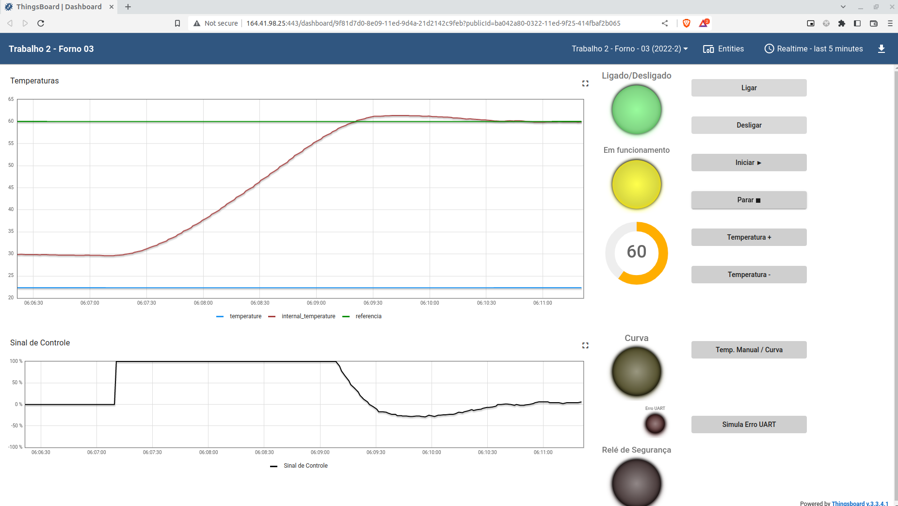
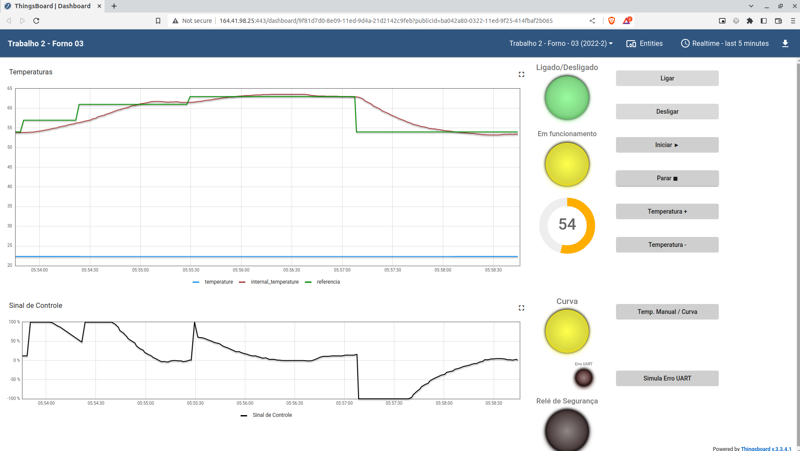

## Trabalho 2 - Fundamentos de Sistemas Embarcados
Este trabalho tem como objetivo a implementação de um sistema que simula um forno de soldagem, com o uso de um reistor de um resistor de potência de 15 Watts utilizado para aumentar temperatura e uma ventoinha que puxa o ar externo para reduzir a temperatura do sistema.
### Como rodar:
```bash
pip install -r requirements.txt
python main.py
```
Para este trabalho foi utilizado o python 3.9.2.
### Como usar
Para interagir com o sistema é utilizado somente as setas do teclado, e para sair do programa basta pressionar ctrl+c.

Após a execução do programa é gerado um arquivo csv com o histórico de metrica retirada durante a execução.
### Resultado com referência fixa

### Resultado com curva

### Vídeo de Apresentação
TODO